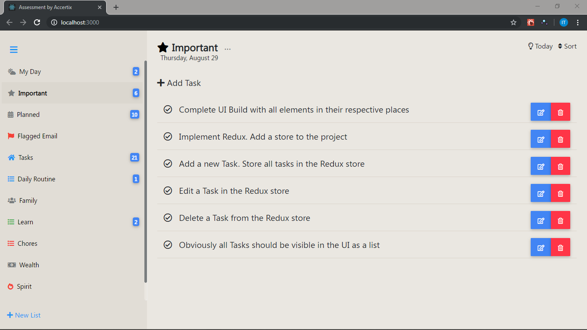

# Accertix Assessment Test

## Task 1
Build the page above in React. It does not need to have any functionality just yet; it just needs to look like this, with the elements in their respective positions.

### Task Completed

## Final Assessment
-    Add a new task. Store all tasks in the Redux store
-    Edit a task in the redux store
-    Delete a task from the redux store.
-    Obviously, all tasks should be visible in the UI as a list.

### Completed

### Additional Features
-   Clicking on a List in the Sidebar makes it active and loads Tasks pertaining to that List.
-   Double-clicking on a list deletes it from the store
-   There are 2 ways to update a Task:
    -   Click on the icon on its left to toggle its status (completed or not)  
    -   Click on the edit button on its right, to edit other details

#### NB
-   Had to replace unavailable icons with similar ones.

-   Tools and Packages used:
    -   React (`create-react-app, react-router-dom`)
    -   [Material Design Bootstrap](https://mdbootstrap.com/) (`mdbreact`)

