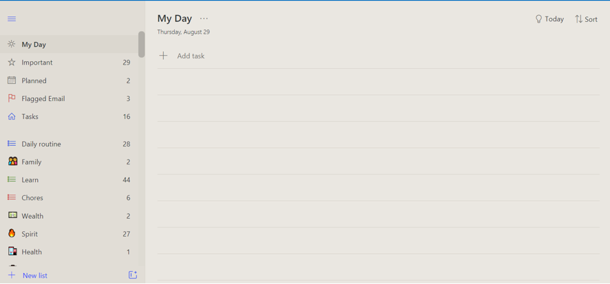
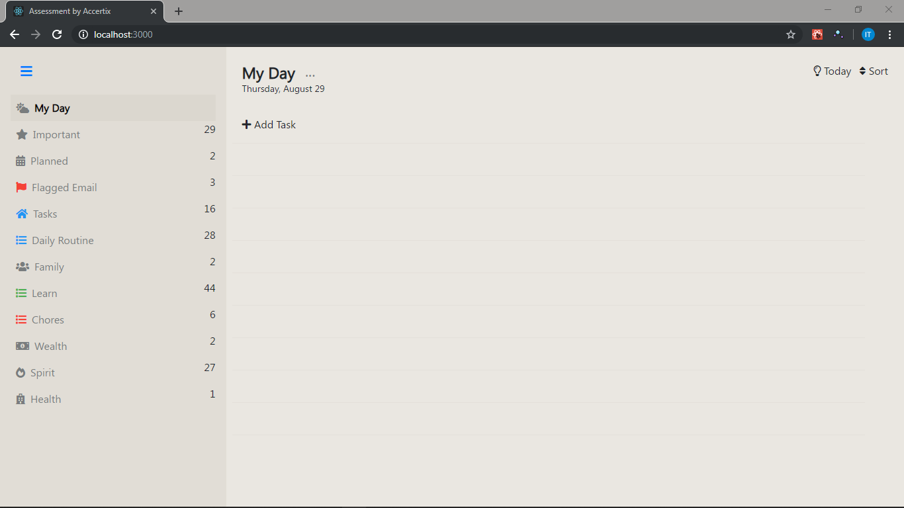

# Accertix Assessment Test

### Task
Build the page above in React. It does not need to have any functionality just yet; it just needs to look like this, with the elements in their respective positions.

### Task Completed

#### NB
-   Had to replace unavailable icons with similar ones.

-   Tools and Packages used:
    -   React (`create-react-app, react-router-dom`)
    -   [Material Design Bootstrap](https://mdbootstrap.com/) (`mdbreact`)

